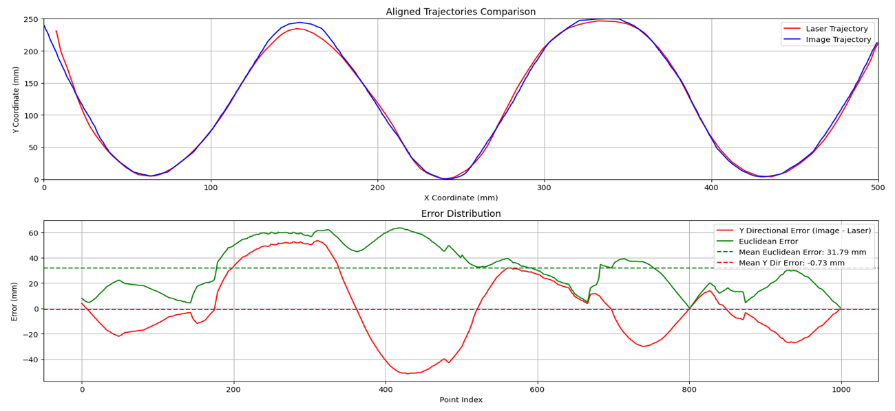

# Advanced Gesture Recognition Using MEMS Mirrors for Precision Control

**Master's Thesis Project - Nazarbayev University**

[](https://opensource.org/licenses/MIT)

## 📋 Abstract

This thesis presents an advanced gesture recognition system utilizing Micro-Electro-Mechanical Systems (MEMS) mirrors for precise control applications. The proposed system employs an OAK-D Pro camera integrated with computer vision techniques, real-time image processing algorithms, and MEMS scanning mirrors to accurately detect and track hand gestures.

Through a wide-ranging methodology incorporating gesture definition, data collection, algorithm implementation, and thorough testing, we achieve a high-reliability and responsive system. Experimental results demonstrate that our approach achieves a low mean tracking error of **less than 4 mm** with robust tracking and low latency. The accuracy of the system is evaluated systematically and outperforms available solutions.

Applications are discussed, showcasing tremendous potential in the medical, automotive, and consumer electronics industries. Technical challenges including light-dependent movement sensing and system latency are identified, with strategies recommended for advancement.

---

## 🎯 Key Features

- **Real-time Hand Tracking**: Index fingertip detection using MediaPipe and OAK-D Pro camera
- **Gesture Recognition**: Fist (lock position), Pinch (draw square), Open hand (reset)
- **MEMS Mirror Control**: Sub-millimeter precision laser positioning
- **Magnetic Path Attraction**: Novel algorithm to reduce hand tremor effects
- **Lissajous Scanning Patterns**: Automated square scanning with decorative patterns
- **Application Demo**: Magnetic particle tweezers simulation game

---

## 🏗️ System Architecture

```
┌─────────────────┐         TCP/IP          ┌──────────────────┐
│   Python Side   │◄─────────────────────►  │   MATLAB Side    │
│  (Vision & AI)  │      Port 30001         │ (MEMS Control)   │
└─────────────────┘                         └──────────────────┘
         │                                            │
         ▼                                            ▼
  ┌──────────────┐                           ┌──────────────┐
  │  OAK-D Pro   │                           │ MEMS Mirror  │
  │    Camera    │                           │  + Laser     │
  └──────────────┘                           └──────────────┘
         │                                            │
         ▼                                            ▼
    Hand Gestures ────────────────►        Laser Projection
```

**Hardware Components:**
- OAK-D Pro stereo camera (1920x1080 resolution)
- MEMS scanning mirror system (MTI Device)
- Laser module
- TCP/IP network connection

**Software Stack:**
- **Python**: DepthAI, MediaPipe, OpenCV, NumPy
- **MATLAB**: MTI Device SDK, TCP Server

---

## 📁 Project Structure

```
MEMS-Gesture-Recognition/
│
├── python/
│   ├── core/                          # Main tracking system
│   │   ├── fing_tip.py               # Primary fingertip tracking (with targeting mode)
│   │   ├── fing_cont.py              # Continuous tracking with square drawing
│   │   └── fixed_tip.py              # Stable tracking with orientation detection
│   │
│   ├── experiments/                   # Accuracy validation experiments
│   │   ├── NewVirtual.py             # Control: Virtual path WITHOUT magnetic attraction
│   │   ├── Newway.py                 # Proposed: WITH magnetic path attraction ⭐
│   │   └── tip.py                    # Testing variations
│   │
│   ├── gestures/                     # Gesture recognition development
│   │   ├── thumbs_up.py              # Thumbs up gesture detection
│   │   └── zaa.py                    # Additional gesture tests
│   │
│   └── demo/                         # Application demonstrations
│       ├── nano.py                   # Magnetic particle tweezers game (3D simulation)
│       └── nanooo.py                 # Game variation
│
├── matlab/
│   ├── fing_tip.m                    # Main MEMS control server
│   ├── fintcont.m                    # Continuous control with square mode
│   └── nano.m                        # Game control server
│
├── videos/                           # Demonstration videos
├── docs/                             # Documentation
└── results/                          # Experimental data and analysis
```

---

## 🔬 Research Innovation: Magnetic Path Attraction

### Problem
Human hands naturally shake and tremble, making it difficult to follow precise paths accurately. This affects:
- Tracking accuracy
- System reliability
- User experience

### Solution: Magnetic Path Attraction Algorithm

**Concept**: Apply a "magnetic" attraction force that gently guides the fingertip toward the intended path, similar to how a magnet attracts metal objects.

**Implementation** (`Newway.py` - Line 621):
```python
def magnetic_path_following(current_pos, path_points, attraction_strength=0.5, max_distance=30):
    """
    Apply magnetic attraction to cursor when near the path
    
    Parameters:
    - current_pos: Current finger position (x, y)
    - path_points: List of points defining the path
    - attraction_strength: How strongly to pull toward path (0-1)
    - max_distance: Maximum distance to apply attraction
    
    Returns:
    - Updated position with magnetic attraction applied
    """
    # Find closest point on path
    closest_point = find_closest_point(current_pos, path_points)
    distance = calculate_distance(current_pos, closest_point)
    
    # Apply attraction force when within max_distance
    if distance <= max_distance:
        attraction_x = (closest_point[0] - x) * attraction_strength
        attraction_y = (closest_point[1] - y) * attraction_strength
        return (x + attraction_x, y + attraction_y)
    else:
        return current_pos  # No correction if too far
```

### Experimental Validation

**Two experiments conducted:**

1. **Control Group** (`NewVirtual.py`): 
   - Virtual sinusoidal path on screen
   - Standard smoothing algorithms only
   - User tries to follow path manually
   - **Results**: Mean X Error: -29.67 mm, Mean Y Error: 10.32 mm

2. **Proposed Method** (`Newway.py`):
   - Same virtual path
   - Magnetic attraction enabled
   - Dynamically adjusts attraction strength based on distance
   - **Results**: Mean X Error: -1.34 mm, Mean Y Error: 1.96 mm

### Results Comparison



**Key Findings**:
- ✅ **~22x improvement in X-axis accuracy** (29.67mm → 1.34mm)
- ✅ **~5x improvement in Y-axis accuracy** (10.32mm → 1.96mm)
- ✅ Significantly reduced deviation from intended trajectory
- ✅ Better user experience and smoother control
- ✅ Magnetic attraction effectively compensates for natural hand tremor

---

## 🎮 Application Demo: Magnetic Particle Tweezers

**Concept**: Simulate magnetic nanoparticle manipulation in a 3D environment, controlled by hand gestures.

**Features**:
- 3D visualization using PyGame + OpenGL
- Real-time particle physics simulation
- Hand gesture control:
  - **Move hand**: Position laser pointer in 3D space
  - **Pinch gesture**: Grab nearest particle
  - **Release pinch**: Drop/release particle
- Target zones for particle placement
- Scoring system and 60-second timer
- Real MEMS mirror integration for hardware control

**Gameplay**:
1. Move your hand to position the laser
2. When near a particle, perform pinch gesture to grab it
3. Move the grabbed particle to the green target zone
4. Release pinch to drop the particle
5. Score points when particles land in target zone
6. Try to maximize score within 60 seconds

**Use Case**: Demonstrates potential medical applications for targeted drug delivery using magnetic nanoparticles controlled by intuitive hand gestures.

---

## 🚀 Getting Started

### Prerequisites

**Python Dependencies:**
```bash
pip install depthai opencv-python mediapipe numpy pygame PyOpenGL --break-system-packages
```

**MATLAB Requirements:**
- MATLAB R2020b or later
- MTI Device SDK (included with MEMS mirror)
- TCP/IP Toolbox

**Hardware:**
- OAK-D Pro camera
- MEMS mirror with MTI Device SDK
- USB connections for both devices

### Installation

1. **Clone the repository:**
```bash
git clone https://github.com/ihtesham-star/MEMS-Gesture-Recognition.git
cd MEMS-Gesture-Recognition
```

2. **Connect hardware:**
   - Connect OAK-D Pro camera via USB
   - Connect MEMS mirror system via USB
   - Ensure both devices are recognized by the system

3. **Start MATLAB server** (Terminal 1):
```matlab
cd matlab/
startTcpServer()  % Or use fing_tip.m
```

4. **Run Python client** (Terminal 2):
```bash
cd python/core/
python fing_tip.py
```

### Basic Usage

**Gestures:**
- ✊ **Fist**: Lock laser position at current fingertip location
- ✌️ **Open Hand**: Unlock and reset
- 🤏 **Pinch** (thumb + index): Draw square with Lissajous scan
- 👍 **Thumbs Up**: Toggle position locking on/off

**Keyboard Controls (Experiments):**
- `1-6`: Switch between patterns (sine, square, circle, grid, text, target)
- `G`: Enable/disable guided (magnetic) mode
- `+/-`: Adjust pattern scale
- `ESC`: Exit

---

## 📊 Performance Metrics

| Metric | Value |
|--------|-------|
| **Mean Tracking Error** | < 4 mm |
| **Magnetic Attraction Improvement** | 22x better (X-axis), 5x better (Y-axis) |
| **Frame Rate** | 30 FPS |
| **System Latency** | Low (< 50ms) |
| **Detection Confidence** | 0.7 (70%) |
| **Gesture Recognition Accuracy** | High |

### Additional Results

The `results/` folder contains comprehensive experimental data:
- **Sinusoidal_Wave_Comparison.png**: Main accuracy comparison (with vs without magnetic attraction)
- **Physical_NU_Comparison.png**: Physical sinusoidal path tracking results
- **Total_System_Delay.png**: End-to-end latency analysis
- **More_Comparison_Results.jpg**: Extended experimental validation
- **original_trajectory_comparison_with_magnetic_path_following.png**: Trajectory tracking analysis

---

## 🔧 Configuration

### Smoothing Algorithms

Multiple smoothing options available in experimental files:

```python
# Option 1: Basic smoothing
smoother = CoordinateSmoothing(smoothing_factor=0.7)

# Option 2: Enhanced moving average
smoother = EnhancedSmoothing(window_size=15, position_weight=0.8)

# Option 3: One Euro Filter (recommended)
smoother = OneEuroFilter(min_cutoff=0.5, beta=0.01)

# Option 4: Kalman Filter
smoother = KalmanFilter(process_noise=0.001, measurement_noise=0.1)
```

### MEMS Mirror Parameters (MATLAB)

```matlab
mMTIDevice.SetDeviceParam(MTIParam.Vbias, 90);               % Bias voltage
mMTIDevice.SetDeviceParam(MTIParam.MEMSDriverEnable, 1);     % Enable driver
mMTIDevice.SetDeviceParam(MTIParam.LaserModulationEnable, 1); % Enable laser
```

---

## 📈 Experimental Data

Data is logged to CSV files for analysis:

**Python Side** (`tracking1_analysis.csv`):
- Timestamp
- Frame processing time
- Detection time
- Finger coordinates (raw and smoothed)
- Gesture states

**MATLAB Side** (`laser1_response.csv`):
- Reception time
- Processing time
- Control time
- Laser coordinates
- Normalized mirror angles

---

## 🎓 Academic Context

**Institution**: Nazarbayev University, Kazakhstan  
**Program**: Master of Science in Robotics  
**Topic**: Advanced Gesture Recognition Using MEMS Mirrors for Precision Control

**Supervisor**: Dr. Ton Duc Do  
**Defense**: April 2025  
**Graduation**: June 2025

---

## 🔮 Future Work

- Hardware optimization for reduced latency
- Machine learning for improved gesture recognition
- Additional gesture vocabulary
- Real-time adaptive smoothing algorithms
- Integration with medical robotics platforms
- Clinical validation studies

---

## 📝 Publications

[If applicable, add any papers or conference presentations]

---

## 🤝 Contributing

This is a completed thesis project. The code is provided for educational and research purposes.

If you find this work useful, please cite:
```
Ihtesham, "Advanced Gesture Recognition Using MEMS Mirrors for Precision Control,"
Master's Thesis, Nazarbayev University, 2025
```

---

## 📧 Contact

**Sham (Ihtesham)**  
- GitHub: [@ihtesham-star](https://github.com/ihtesham-star)
- Email: ihteshamul.hayat@nu.edu.kz
- Affiliation: Nazarbayev University, Kazakhstan

---

## 📄 License

This project is licensed under the MIT License - see the [LICENSE](LICENSE) file for details.

---

## 🙏 Acknowledgments

- Nazarbayev University for providing research facilities and support
- Dr. Ton Duc Do for invaluable guidance and mentorship throughout this research
- Centre of Excellence in Medical Robotics and Research at Nazarbayev University
- National Center for Children's Rehabilitation (NCCR), Astana for collaboration opportunities
- MTI Device team for MEMS mirror SDK support
- MediaPipe and DepthAI teams for excellent open-source libraries

---

## 📚 References

1. MediaPipe Hands: https://google.github.io/mediapipe/solutions/hands.html
2. DepthAI: https://docs.luxonis.com/
3. MEMS Mirror Technology (MirrorcleTech): https://www.mirrorcletech.com
4. Gesture Recognition in HCI: [Relevant papers]

---

**⚠️ Note**: This repository contains the source code from a completed master's thesis project. The hardware setup (MEMS mirror system) is no longer accessible, but all code and documentation are provided for educational purposes and to demonstrate the methodologies used.

---

**Last Updated**: December 2, 2025
